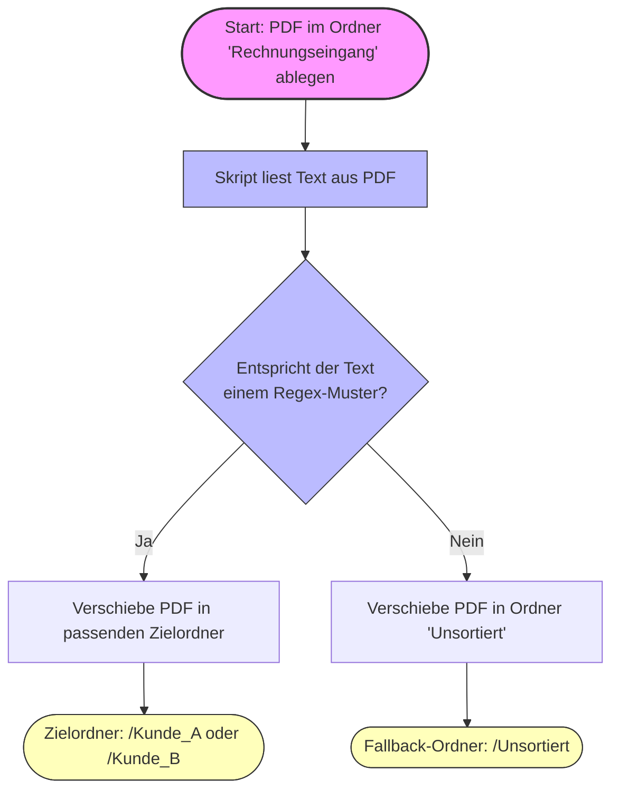

# Dokumentensortierung

Dieses Python-Skript überwacht ein bestimmtes Verzeichnis auf neue PDF-Dateien und sortiert sie basierend auf vordefinierten Suchbegriffen in entsprechende Unterordner. 

## Einrichtung

1. Kopiere die Datei `config.example.json` und benenne die Kopie um in `config.json`.
2. Öffne die `config.json` und passe die Pfade (`watch_dir`, `default_dir` und `target`) sowie die Suchbegriffe (`patterns`) nach deinen Wünschen an.
3. Starte das Skript:
   ```bash
   python pdf_sorter.py
   ```
   
## Virtuelle Umgebung erstellen (optional, aber empfohlen)

```bash
# Virtuelle Umgebung erstellen
python -m venv .venv

# Aktivieren (Windows PowerShell)
.\.venv\Scripts\Activate.ps1

# Aktivieren (macOS/Linux)
source .venv/bin/activate
```

## Ablauf



